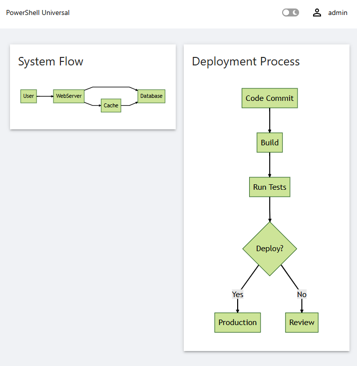

# UniversalDashboard.Mermaid

A PowerShell Universal component that enables rendering of [Mermaid](https://mermaid.js.org/) diagrams within Universal applications. Mermaid is a JavaScript-based diagramming and charting tool that allows you to create complex diagrams using a simple markdown-like syntax.



## Features

- **Multiple Diagram Types**: Support for flowcharts, sequence diagrams, Gantt charts, class diagrams, state diagrams, and more
- **Customizable Themes**: Configure appearance with built-in themes (default, forest, dark, neutral)
- **Easy Integration**: Simple PowerShell cmdlet interface for creating diagrams
- **Dynamic Configuration**: Pass custom Mermaid configuration options

## Installation

### From PowerShell Gallery (Coming Soon)

```powershell
Install-Module -Name UniversalDashboard.Mermaid
```

### Manual Installation

1. Download or clone this repository
2. Build the project (see [Building](#building) section)
3. Copy the contents of the `output` folder to your PowerShell Universal modules directory or use `Import-Module`:

```powershell
Import-Module .\output\UniversalDashboard.Mermaid.psd1
```

## Usage in PowerShell Universal

### Basic Example

```powershell
New-UDDashboard -Title "Mermaid Diagram Demo" -Content {
    New-UDMermaid -Diagram @"
graph TD
    A[Start] --> B{Is it working?}
    B -->|Yes| C[Great!]
    B -->|No| D[Debug]
    D --> A
"@
}
```

### Flowchart Example

```powershell
New-UDMermaid -Diagram @"
graph LR
    A[Square Rect] --> B(Round Rect)
    B --> C{Decision}
    C -->|One| D[Result 1]
    C -->|Two| E[Result 2]
"@
```

### Sequence Diagram Example

```powershell
New-UDMermaid -Diagram @"
sequenceDiagram
    participant Alice
    participant Bob
    Alice->>John: Hello John, how are you?
    loop HealthCheck
        John->>John: Fight against hypochondria
    end
    Note right of John: Rational thoughts!
    John-->>Alice: Great!
    John->>Bob: How about you?
    Bob-->>John: Jolly good!
"@
```

### Gantt Chart Example

```powershell
New-UDMermaid -Diagram @"
gantt
    title A Gantt Diagram
    dateFormat  YYYY-MM-DD
    section Section
    A task           :a1, 2014-01-01, 30d
    Another task     :after a1, 20d
    section Another
    Task in sec      :2014-01-12, 12d
    another task     :24d
"@
```

### Class Diagram Example

```powershell
New-UDMermaid -Diagram @"
classDiagram
    Animal <|-- Duck
    Animal <|-- Fish
    Animal <|-- Zebra
    Animal : +int age
    Animal : +String gender
    Animal: +isMammal()
    Animal: +mate()
    class Duck{
        +String beakColor
        +swim()
        +quack()
    }
    class Fish{
        -int sizeInFeet
        -canEat()
    }
    class Zebra{
        +bool is_wild
        +run()
    }
"@
```

### State Diagram Example

```powershell
New-UDMermaid -Diagram @"
stateDiagram-v2
    [*] --> Still
    Still --> [*]
    Still --> Moving
    Moving --> Still
    Moving --> Crash
    Crash --> [*]
"@
```

### Custom Configuration

You can customize the appearance and behavior using the `-Config` parameter:

```powershell
New-UDMermaid -Diagram @"
graph TD
    A[Client] --> B[Load Balancer]
    B --> C[Server1]
    B --> D[Server2]
"@ -Config @{
    theme = 'dark'
    flowchart = @{
        curve = 'basis'
    }
}
```

### Using in a Dashboard with Multiple Components

```powershell
New-UDDashboard -Title "System Architecture" -Content {
    New-UDRow -Columns {
        New-UDColumn -Size 6 -Content {
            New-UDCard -Title "System Flow" -Content {
                New-UDMermaid -Diagram @"
graph LR
    User --> WebServer
    WebServer --> Database
    WebServer --> Cache
    Cache --> Database
"@
            }
        }
        
        New-UDColumn -Size 6 -Content {
            New-UDCard -Title "Deployment Process" -Content {
                New-UDMermaid -Diagram @"
graph TD
    Commit[Code Commit] --> Build[Build]
    Build --> Test[Run Tests]
    Test --> Deploy{Deploy?}
    Deploy -->|Yes| Prod[Production]
    Deploy -->|No| Review[Review]
"@
            }
        }
    }
}
```

## New-UDMermaid Cmdlet

### Syntax

```powershell
New-UDMermaid [-Id <String>] -Diagram <String> [-Config <Hashtable>]
```

### Parameters

- **Id** (Optional): The unique identifier for the component. If not specified, a GUID will be generated automatically.
- **Diagram** (Required): The Mermaid diagram definition as a string.
- **Config** (Optional): A hashtable of configuration options for Mermaid. See [Mermaid Configuration](#mermaid-configuration) for available options.

## Mermaid Configuration

The `-Config` parameter accepts a hashtable with various Mermaid configuration options:

### Common Options

```powershell
@{
    theme = 'default'  # Options: 'default', 'forest', 'dark', 'neutral'
    logLevel = 'fatal' # Options: 'debug', 'info', 'warn', 'error', 'fatal'
    securityLevel = 'strict' # Options: 'strict', 'loose', 'antiscript'
}
```

### Flowchart Specific

```powershell
@{
    flowchart = @{
        htmlLabels = $true
        curve = 'basis'  # Options: 'basis', 'linear', 'cardinal'
    }
}
```

### Sequence Diagram Specific

```powershell
@{
    sequence = @{
        mirrorActors = $true
        showSequenceNumbers = $false
    }
}
```

For a complete list of configuration options, see the [Mermaid documentation](https://mermaid.js.org/config/setup/modules/mermaidAPI.html).

## About Mermaid Diagrams

Mermaid is a JavaScript-based diagramming and charting tool that uses markdown-inspired text definitions to create and modify diagrams dynamically. It supports multiple diagram types:

- **Flowcharts**: Visualize processes and workflows
- **Sequence Diagrams**: Show interactions between different actors
- **Gantt Charts**: Project planning and scheduling
- **Class Diagrams**: UML class relationships
- **State Diagrams**: State machines and transitions
- **Entity Relationship Diagrams**: Database schemas
- **User Journey Diagrams**: User experience flows
- **Pie Charts**: Data visualization
- **Git Graphs**: Version control branching
- **And more!**

Learn more at [mermaid.js.org](https://mermaid.js.org/)

## Building

This project uses npm and webpack for building the React components, and PowerShell's Invoke-Build for the build automation.

### Prerequisites

- **Node.js** (v14 or higher recommended)
- **npm** (comes with Node.js)
- **PowerShell** 5.1 or PowerShell Core 7+
- **InvokeBuild** PowerShell module

Install InvokeBuild if you haven't already:

```powershell
Install-Module -Name InvokeBuild -Scope CurrentUser
```

### Build Steps

1. **Clone the repository**:
   ```powershell
   git clone https://github.com/ironmansoftware/ud-mermaid.git
   cd ud-mermaid
   ```

2. **Run the build**:
   ```powershell
   Invoke-Build
   ```

   This will:
   - Clean the `output` and `public` directories
   - Install npm dependencies (with legacy peer deps support)
   - Build the React components using webpack
   - Copy the built files to the `output` directory
   - Include the PowerShell module files (.psd1 and .psm1)

3. **Output**: The compiled module will be available in the `output` directory.

### Manual Build

If you prefer to build manually:

```powershell
# Install dependencies
npm install --legacy-peer-deps

# Build for production
npm run build

# Or build for development
npm run dev
```

### Troubleshooting Build Issues

If you encounter OpenSSL-related errors during the build, the build script automatically sets the `NODE_OPTIONS` environment variable. If building manually, use:

```powershell
$env:NODE_OPTIONS="--openssl-legacy-provider"
npm run build
```

## Project Structure

```
ud-mermaid/
├── Components/           # React component source files
│   ├── component.jsx    # Component wrapper
│   ├── index.js         # Component exports
│   └── mermaid.jsx      # Main Mermaid component
├── output/              # Built module (generated)
├── public/              # Webpack build output
├── component.build.ps1  # InvokeBuild script
├── package.json         # npm dependencies
├── webpack.config.js    # Webpack configuration
├── UniversalDashboard.Mermaid.psd1  # Module manifest
└── UniversalDashboard.Mermaid.psm1  # Module script
```

## Development

### Testing Your Changes

After building, you can test the component locally:

```powershell
# Import the built module
Import-Module .\output\UniversalDashboard.Mermaid.psd1 -Force

# Create a test dashboard
Start-UDDashboard -Dashboard (New-UDDashboard -Title "Test" -Content {
    New-UDMermaid -Diagram "graph TD; A-->B;"
})
```

### Making Changes

1. Modify the React components in the `Components` directory
2. Run `Invoke-Build` to rebuild
3. Restart your dashboard to see changes

## Dependencies

### PowerShell
- Universal Dashboard framework

### JavaScript/NPM
- mermaid: ^9.4.3
- universal-dashboard: ^1.0.1
- React (bundled via universal-dashboard)
- Webpack and Babel for building

## Version

Current version: 0.0.1

## Author

Adam Driscoll

## License

Copyright (c) Adam Driscoll. All rights reserved.

## Contributing

Contributions are welcome! Please feel free to submit issues or pull requests.

## Support

For issues, questions, or suggestions, please open an issue on the GitHub repository.

## Links

- [Mermaid Documentation](https://mermaid.js.org/)
- [PowerShell Universal](https://www.powershelluniversal.com/)
- [Universal Dashboard](https://docs.powershelluniversal.com/dashboard)
